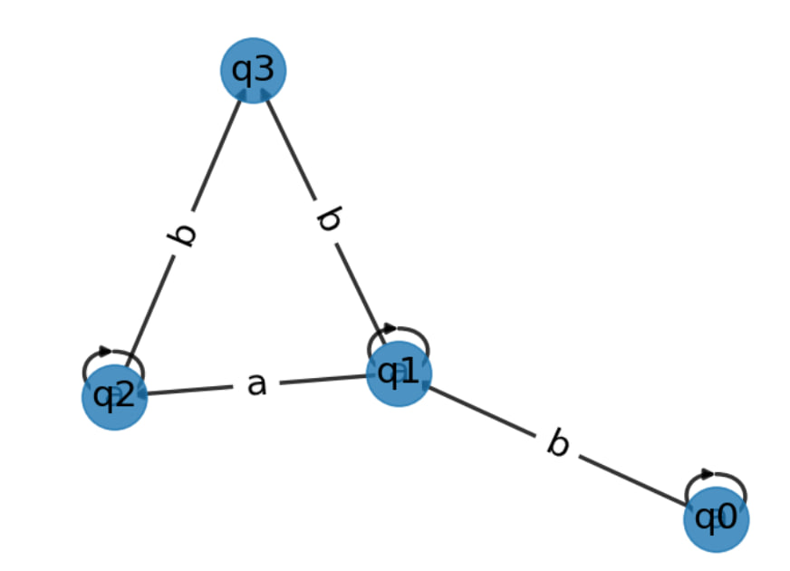

# Report Laboratory 2 

### Course: Formal Languages & Finite Automata

### Elaborated by: Cozlov Valeria, FAF-213

## Theory

The main concepts used in that laboratory work are:

- Grammar: A grammar is a set of rules for generating strings in a language. In computer science, grammars are often used to describe the syntax of programming languages or other formal languages. A grammar consists of a set of production rules that specify how to form valid strings in the language.
- Finite state automaton: A finite state automaton (FSA) is a mathematical model of computation that can be used to recognize or generate strings in a language. An FSA consists of a finite number of states, which can transition between each other based on input symbols.
- Non-Deterministic Finite Automaton: NFA is a type of FSA where multiple transitions can be made from a single state on the same input symbol.
- Deterministic Finite Automaton: DFA is a type of FSA where there is only one transition from each state on a given distinct input symbol.
<ul> 
<li>Chomsky Classification: Chomsky hierarchy is a way of classifying formal languages based on the type of grammar that generates them. The hierarchy consists of four levels:</li>
<ul>
<li>Type 0: Unrestricted grammars</li>
<li>Type 1: Context-sensitive grammars</li>
<li>Type 2: Context-free grammars</li>
<li>Type 3: Regular grammars</li>
</ul>
</ul>

##  Objectives
1. Understand what an automaton is and what it can be used for.
2. Continuing the work in the same repository and the same project, the following need to be added:
   a. Provide a function in your grammar type/class that could classify the grammar based on Chomsky hierarchy.
   b. For this you can use the variant from the previous lab.
3. According to your variant number (28), get the finite automaton definition and do the following tasks:
   a. Implement conversion of a finite automaton to a regular grammar.
   b. Determine whether your FA is deterministic or non-deterministic.
   c. Implement some functionality that would convert an NDFA to a DFA.
   
## Implementation
In order to show the execution you can implement a client class/type, which is just a ”Main” class/type
in which you can instantiate the types/classes. Another approach would be to write unit tests if you
are familiar with them. The python code is presented in the Lab 2 folder. 

Below is the image below graphically represents the finite automaton.

## Conclusion
In conclusion, formal languages and finite automata are important concepts in computer science that have significant implications for various fields such as artificial intelligence, natural language processing, and computational linguistics. 
Understanding the fundamental concepts of formal languages and finite automata, including determinism, conversion from NFAs to DFAs, and the Chomsky hierarchy, is crucial for designing efficient algorithms and developing powerful computational models. 
With their ability to recoganize and generate languages, formal languages and finite automata provide a theoretical foundation for designing efficient and reliable computer systems, making them vital to the advancement of modern technology.
